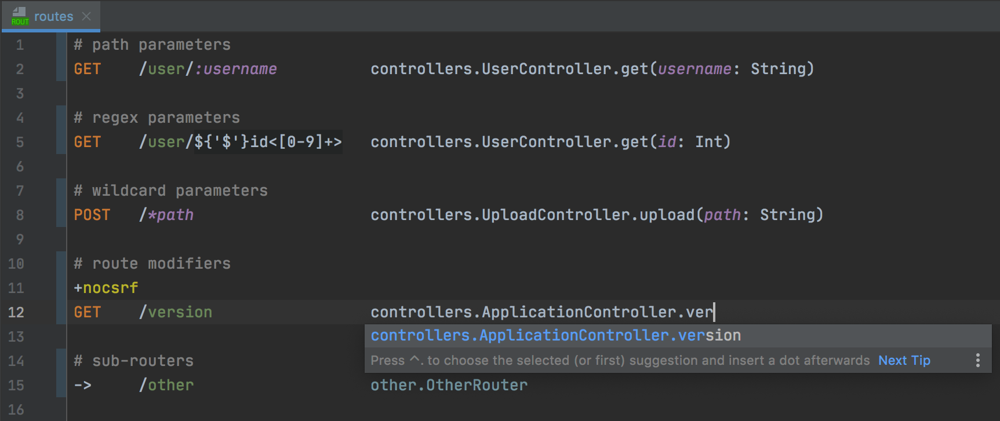

# Intelliroutes - IntelliJ plugin for `routes` files support.

`routes` files are used in [Play framework](https://www.playframework.com/) for defining HTTP endpoints.

## Releases
See the [plugin repository](https://plugins.jetbrains.com/plugin/10053-play-routes).

## Credits
Thanks [ASI Data Science](https://github.com/ASIDataScience) for letting me spend some of my work time on this project.
